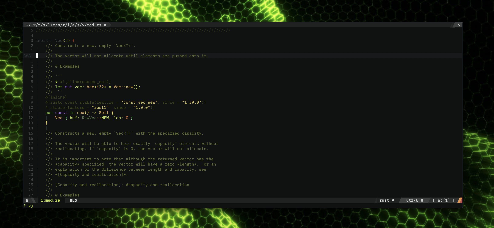

# vim-jimbothemes

Self developed morden vim themes (mainly for neovim)

I created these themes myself via wandering around the beautiful wallpapers in
[wallpaperbetter.com](https://www.wallpaperbetter.com/)

I don't know the original authors of these wallpapers but the inspiration credits go to them.

Theme nordic-aurora was inspired from [ImageGoNord](https://github.com/Schrodinger-Hat/ImageGoNord). Color palette was strictly followed the guideline there. Credits go to them. I have not yet found a suitable wallpaper for this theme.

All theme wallpapers are under the wallpapers subdir. The nordic-aurora wallpaper credit goes to [here](https://www.reddit.com/r/nordtheme/comments/f1dyk2/made_this_wallpaper_from_a_graphic_on_nords/)

# Installation

```VimL
Plug 'i3d/vim-jimbothemes' " or any other package manager
"...
set background=dark   " all jimbothemes are dark background themes
set termguicolors     " enable true colors support. !Required!
colorscheme xxxx      " pick the color theme you like
```

# Update

```VimL
:PlugUpdate vim-jimbothemes
```

!NOTE: Themes are still actively developing and improving, so update often.

# Screenshots

## ironman_dark


```VimL
set background=dark
set termguicolors
colorscheme ironman_dark
```

## batman

### The batman theme is designed with the color palette from the wallper and also the batman iterm color scheme.


```VimL
set background=dark
set termguicolors
colorscheme batman
```

## breakingbad


```VimL
set background=dark
set termguicolors
colorscheme breakingbad
```

## vim cody


```VimL
set background=dark
set termguicolors
colorscheme cody
```

## cold


```VimL
set background=dark
set termguicolors
colorscheme cold
```

## matrix (**this theme is what I am currently using and it is highly tweaked**)


```VimL
set background=dark
set termguicolors
colorscheme matrix
let g:airline_theme = 'biogoo'
```

If you use (Airline)[https://github.com/vim-airline/vim-airline], then Airline theme 'biogoo' is highly recommended to pair with this theme. They are almost in perfect match.

## dark matrix (**NEW DarkMatrix I am developing, targeting low light**)


```VimL
set background=dark
set termguicolors
colorscheme darkmatrix
let g:airline_theme = 'biogoo'
```

If you use (Airline)[https://github.com/vim-airline/vim-airline], then Airline theme 'biogoo' is highly recommended to pair with this theme. They are almost in perfect match.

## neonhive



```VimL
set background=dark
set termguicolors
colorscheme neonhive
```

## nordic-aurora


```VimL
set background=dark
set termguicolors
colorscheme nordic-aurora
```

## superman


```VimL
set background=dark
set termguicolors
colorscheme superman
```

## topology


```VimL
set background=dark
set termguicolors
colorscheme topology
```
